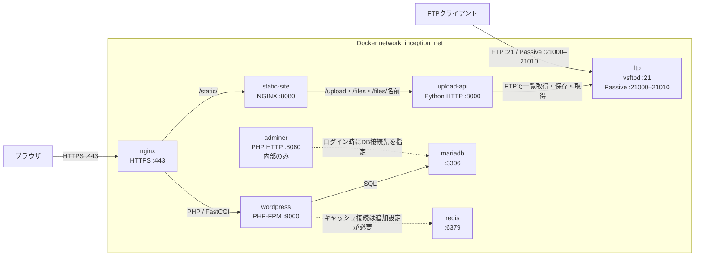
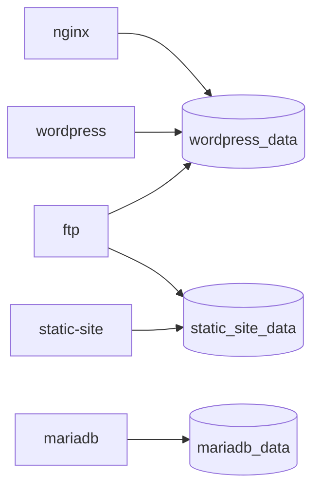
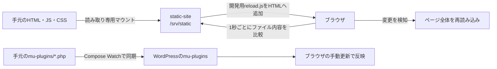

# Inception

Docker ComposeでWordPress、静的サイト、FTPによるファイル管理を動かすプロジェクトです。
以下はリポジトリに定義されている現在の構成です。

## 実行方法

```sh
cp .env.example .env
# .env 内の change_this_* を置き換える
make
```

`.env` は認証情報を含むためGit管理されません。設定例には `.env.example` を使います。
ローカルで利用する場合は、`shattori.42.fr` がDockerホストを指すように名前解決を設定します。
現在のNGINXのホスト名と自己署名証明書は `shattori.42.fr` 固定です。
別ドメインを使う場合は `.env` の `DOMAIN_NAME` に加え、NGINXの設定・証明書も変更してください。

## システム構成

全サービスが共通のDockerブリッジネットワーク `inception_net` に所属します。
実線はリクエストの経路、点線は手動設定・操作が必要な接続を表します。



| サービス | 役割 | ホストへの公開ポート |
| --- | --- | --- |
| `nginx` | HTTPS終端、WordPressの静的ファイル配信、PHPとstatic siteへの振り分け | `443` |
| `wordpress` | PHP-FPMでWordPressを実行。ホームにstatic siteへのリンクを表示 | なし |
| `mariadb` | WordPressのデータベース | なし |
| `redis` | キャッシュ用Redisサーバー | なし |
| `static-site` | HTML・JavaScript・CSSとファイル操作画面の配信 | なし |
| `upload-api` | 認証後にFTP経由でファイルを操作 | なし |
| `ftp` | WordPress・static siteの共有ファイルへアクセス | `21`、`21000–21010` |
| `adminer` | データベース管理画面 | なし |

WordPressのセットアップは `redis-cache` プラグインを未導入の場合にインストール・有効化します。
ただし、Redisホストの指定やオブジェクトキャッシュの有効化はスクリプトに含まれていません。
Adminerにも外部公開ポートやNGINXの転送ルートは定義されていません。

## URLとファイル操作

| URL・パス | 処理 |
| --- | --- |
| `https://shattori.42.fr/` | WordPressホーム |
| `/wp-admin/` | WordPress管理画面 |
| `/static` | `/static/` へリダイレクト |
| `/static/` | ファイルのアップロード・一覧取得・ダウンロード画面 |
| `/static/upload` | アップロードAPI（POST） |
| `/static/files` | ファイル一覧API（GET） |
| `/static/files/{名前}` | ファイル取得API（GET） |

static siteの各操作ではFTPユーザー名とパスワードを入力します。
パスワード欄は伏せ字で表示され、APIにはHTTPS経由のBasic認証として送信されます。
APIは `.env` の `FTP_USER` / `FTP_PASSWORD` で認証し、FTPサーバーへ接続します。
アップロード先はFTPコンテナの `/var/www/html/uploads/` です。

## データの永続化



| ボリューム | 保存先 | コンテナのマウント先 |
| --- | --- | --- |
| `wordpress_data` | `${DATA_PATH}/wordpress` | nginx・wordpress・ftpの `/var/www/html` |
| `mariadb_data` | `${DATA_PATH}/mariadb` | mariadbの `/var/lib/mysql` |
| `static_site_data` | Docker管理の名前付きボリューム | static-siteの `/var/www/static`、ftpの `/var/www/html/static-site` |

Makefile経由では `DATA_PATH` は既定で `~/data` です。
WordPressとMariaDBは、ホストのディレクトリをバインドするローカルドライバーの名前付きボリュームを使います。
ファイル操作APIのアップロードは `wordpress_data` に保存されます。
Redisには永続化ボリュームを設定していません。

通常起動のstatic siteは、ボリュームに `index.html` がない場合だけイメージ内の初期ファイルをコピーします。
そのため、既存ボリュームがある場合は再ビルドだけでは配信ファイルが更新されません。

## 開発モード（Live Reload）

```sh
make dev
```

`docker-compose.yml` に `docker-compose.dev.yml` を重ねて起動します。



- `services/static-site/` の `index.html`・`script.js`・`style.css` を保存すると、約1秒でブラウザを自動更新します。
- ページ全体を再読み込みするため、入力内容や選択中のファイルはリセットされます。
- `services/wordpress/mu-plugins/` のPHPは自動同期されます。WP画面は手動で更新してください。
- DockerfileやNGINX設定を変更した場合は `make dev` を再起動してください。
- 開発用マウントはソースを直接配信します。通常起動で使うstatic siteのボリュームにはソース変更をコピーしません。

`Ctrl-C` で開発モードを停止し、`make up` で通常構成へ戻せます。

## 起動・停止

| コマンド | 動作 |
| --- | --- |
| `make` / `make up` | ビルドしてバックグラウンド起動 |
| `make dev` | Live Reload付きでフォアグラウンド起動 |
| `make down` | コンテナを停止・削除。永続データは保持 |
| `make wordpress-up` | WordPressを再ビルドして起動 |
| `make fclean` | ボリューム・イメージなども削除する破壊的なクリーンアップ |

全サービスに `restart: always` を設定しています。
Composeの `depends_on` は、MariaDB・Redis → WordPress → NGINX、MariaDB → Adminer、FTP → upload-apiの起動順を指定します。
サービスの準備完了を待つヘルスチェックは未設定ですが、WordPressの起動スクリプトはMariaDBの応答を待ちます。

詳細は [開発者向けドキュメント](DEV_DOC.md) と [利用者向けドキュメント](USER_DOC.md) を参照してください。
