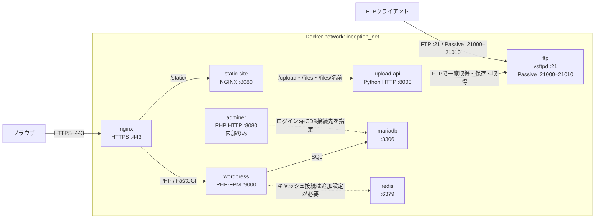
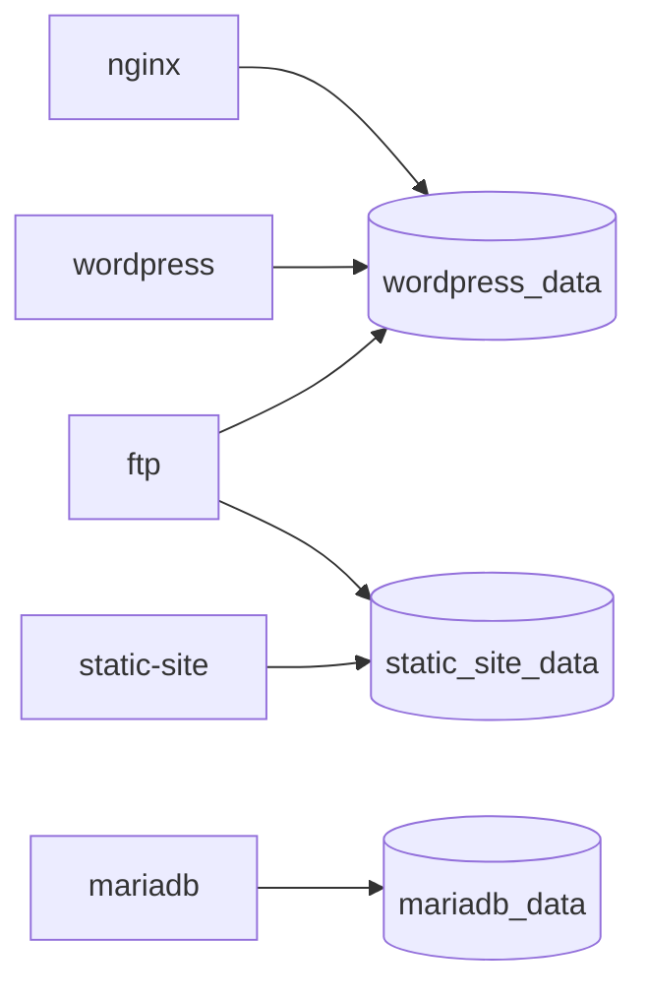
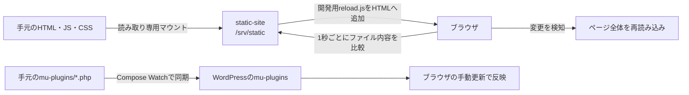

# Inception

## Project Description

Inception is a system administration project that builds a small web infrastructure using Docker and Docker Compose.

The infrastructure is composed of multiple isolated services, including NGINX, WordPress, MariaDB, Redis, FTP, Adminer, a static website, and an upload API. Each service runs in its own Docker container and communicates with other services through a dedicated Docker bridge network.

Docker Compose is used to define, build, configure, and connect all containers from a single configuration file. This makes the infrastructure reproducible and allows the complete environment to be started with a small number of commands.

### Docker Usage

Each major service runs in a separate container.

The main containers are:

- **NGINX**: HTTPS entry point and reverse proxy.
- **WordPress**: Runs WordPress using PHP-FPM.
- **MariaDB**: Stores WordPress database data.
- **Redis**: Provides an in-memory cache service.
- **FTP**: Provides file access using vsftpd.
- **Adminer**: Provides a web-based database administration interface.
- **Static Site**: Serves the static HTML, CSS, and JavaScript interface.
- **Upload API**: Handles authenticated file operations and communicates with the FTP service.

The containers are built from the Dockerfiles and configuration files included in the `services/` directory.

The project also includes:

- `docker-compose.yml` for the main infrastructure definition.
- `docker-compose.dev.yml` for development-specific overrides.
- `.env.example` as an example of the required environment configuration.
- `Makefile` for common build, start, stop, and cleanup operations.
- NGINX configuration files for HTTPS and request routing.
- WordPress initialization scripts and custom WordPress code.
- MariaDB initialization scripts.
- FTP configuration and startup scripts.
- Static website source files.
- Upload API source code.
- Documentation for both users and developers.

No pre-built application images are used for the main project services when the service is expected to be built from the project's own Dockerfile. Base operating system images are used to construct the containers and install only the software required by each service.

### Main Design Choices

The infrastructure follows a service-oriented container design.

Each major responsibility is separated into its own container instead of installing every component in a single container. This keeps services isolated and makes their dependencies and network relationships explicit.

NGINX is the only HTTP service directly exposed to the host on port 443. Internal services such as WordPress, MariaDB, Redis, and the static-site backend communicate through the Docker network and do not need to expose their internal ports directly to the host.

Persistent application data is stored outside the lifecycle of individual containers through Docker volumes. This allows containers to be rebuilt or replaced without losing WordPress files or database data.

Configuration values that can vary between environments are supplied through environment variables instead of being hard-coded directly into the images.

---

### Virtual Machines vs Docker

A Virtual Machine emulates a complete machine and normally runs its own operating system and kernel. Because of this, virtual machines provide strong isolation but require more CPU, memory, disk space, and startup time.

Docker containers provide process-level isolation while sharing the Linux kernel of the host system. A container normally contains only the application and the libraries required to run it.

| Virtual Machines | Docker Containers |
| --- | --- |
| Run a complete guest operating system | Share the host kernel |
| Require more memory and disk space | Generally lightweight |
| Usually take longer to start | Usually start quickly |
| Strong machine-level isolation | Process and namespace isolation |
| Suitable for running different operating systems | Suitable for isolated application services |

Docker was selected for this project because the objective is to run several Linux services independently without requiring a complete virtual machine for every service.

A virtual machine may still be used as the Docker host, but inside that machine Docker provides the isolation between NGINX, WordPress, MariaDB, Redis, and the other services.

---

### Secrets vs Environment Variables

Environment variables provide configuration values to applications at runtime.

For example:

```text
DOMAIN_NAME
MYSQL_DATABASE
MYSQL_USER
FTP_USER
```

They are convenient and easy to use with Docker Compose, but sensitive environment variables can potentially be exposed through container configuration, debugging output, process environments, or accidental logging.

Docker secrets are designed specifically for sensitive values such as passwords and credentials. Instead of exposing the secret directly as an environment variable, the secret is normally mounted inside the container as a file.

| Environment Variables | Docker Secrets |
| --- | --- |
| Easy to configure | Designed for sensitive information |
| Suitable for normal configuration | Suitable for passwords and credentials |
| Available directly to the process environment | Usually exposed as files |
| Can be accidentally printed or inspected | Reduce exposure of secret values |

This project currently uses a `.env` file for configuration and credentials. The real `.env` file is excluded from Git, while `.env.example` documents the required variables without containing real credentials.

For a production environment, secrets would generally be preferable for sensitive credentials, while environment variables would remain appropriate for non-sensitive configuration such as domain names and service options.

---

### Docker Network vs Host Network

Docker provides isolated virtual networks that allow containers to communicate with each other.

This project uses a dedicated bridge network called:

```text
inception_net
```

Containers on this network can reach each other using Docker DNS and their Compose service names.

For example:

```text
wordpress:9000
mariadb:3306
redis:6379
adminer:8080
```

With host networking, a container uses the networking namespace of the Docker host directly. There is significantly less separation between the container and host networking environment.

| Docker Bridge Network | Host Network |
| --- | --- |
| Containers have isolated networking | Container shares the host network |
| Docker DNS can resolve service names | Host networking configuration is used directly |
| Ports can be selectively published | Services bind directly to host ports |
| Provides better service separation | Provides less network isolation |
| Convenient for multi-container applications | Useful for specific performance or networking requirements |

A Docker bridge network was selected because the services should communicate privately while exposing only the ports that actually need to be accessible from outside Docker.

For example, MariaDB can listen on port `3306` inside `inception_net` without making port `3306` available directly on the host.

---

### Docker Volumes vs Bind Mounts

Container filesystems are normally temporary. If a container is removed, data stored only inside that container can disappear.

Docker volumes and bind mounts allow data to exist outside the writable layer of a container.

A Docker-managed volume is managed by Docker and does not require the application to depend directly on a particular host filesystem path.

A bind mount maps a specific host directory directly into a container.

| Docker Volumes | Bind Mounts |
| --- | --- |
| Managed by Docker | Maps a specific host path |
| Less dependent on host directory structure | Directly tied to the host filesystem |
| Well suited for persistent application data | Useful for development and direct file editing |
| Easier to manage as Docker resources | Convenient when host access is required |

This project uses persistent storage for WordPress and MariaDB so that their data survives container recreation.

The WordPress and MariaDB volumes use host-backed storage under the configured data directory, while Docker-managed volumes are also used where direct access to a host directory is unnecessary.

Bind mounts are particularly useful in development mode. For example, the static website source can be mounted directly from the source tree so that modifications become visible without rebuilding the container.

The storage mechanism is therefore selected according to the purpose:

- persistent service data should survive container recreation;
- development source code should be easy to modify from the host;
- temporary runtime data should remain inside the container when persistence is unnecessary.

# Inception

Docker Compose を使用して、WordPress、静的サイト、FTP によるファイル管理、MariaDB、Redis、Adminer などを複数のコンテナとして構築・連携させるプロジェクトです。

このプロジェクトでは、それぞれのサービスを独立した Docker コンテナとして実行し、Docker Compose を用いてネットワーク、ボリューム、環境変数、依存関係をまとめて管理します。

---

## プロジェクト概要

Inception は、Docker と Docker Compose を利用して小規模な Web インフラストラクチャを構築するシステム管理プロジェクトです。

NGINX、WordPress、MariaDB、Redis、FTP、Adminer、静的 Web サイト、ファイルアップロード API などをそれぞれ独立したコンテナとして実行します。

各サービスは共通の Docker ブリッジネットワーク `inception_net` に接続され、必要なサービス同士だけが内部ネットワーク上で通信します。

外部からの HTTP/HTTPS アクセスは基本的に NGINX を入口とし、WordPress や静的サイトなどの内部サービスへリクエストを振り分けます。

### Docker を使用する理由

Docker を利用することで、各サービスに必要なソフトウェアや設定を個別のコンテナに分離できます。

たとえば、

- NGINX
- WordPress / PHP-FPM
- MariaDB
- Redis
- FTP
- Adminer
- Static Site
- Upload API

をそれぞれ独立して実行します。

これにより、あるサービスの設定変更が他のサービスへ直接影響しにくくなり、インフラ構成も明確になります。

Docker Compose は、これら複数のコンテナについて以下を一括して管理します。

- コンテナのビルド
- 環境変数
- ネットワーク
- ボリューム
- 公開ポート
- サービス間の依存関係

---

## プロジェクトに含まれる主なソース

このリポジトリには以下のようなファイルやソースが含まれています。

- `docker-compose.yml`
  - 本番構成のサービス定義
- `docker-compose.dev.yml`
  - 開発モード用の追加設定
- `Makefile`
  - ビルド・起動・停止・削除などの操作
- `.env.example`
  - 必要な環境変数の例
- `services/nginx/`
  - NGINX の Dockerfile、TLS、リバースプロキシ設定
- `services/wordpress/`
  - WordPress、PHP-FPM、初期化スクリプト、MU Plugin
- `services/mariadb/`
  - MariaDB の構築・初期化設定
- `services/redis/`
  - Redis サーバー
- `services/ftp/`
  - vsftpd の設定と起動処理
- `services/static-site/`
  - HTML、CSS、JavaScript による静的サイト
- `services/upload-api/`
  - FTP を利用したファイル操作 API
- `services/adminer/`
  - MariaDB を管理するための Adminer
- `DEV_DOC.md`
  - 開発者向けドキュメント
- `USER_DOC.md`
  - 利用者向けドキュメント

---

## 主な設計方針

このプロジェクトでは、1つのコンテナにすべての機能を入れるのではなく、役割ごとにサービスを分割しています。

たとえば、

- NGINX は HTTPS とリクエストの振り分け
- WordPress は PHP アプリケーション実行
- MariaDB はデータ保存
- Redis はキャッシュ
- FTP はファイル転送
- Adminer はデータベース管理

というように責務を分離しています。

また、MariaDB や Redis のような内部サービスはホストへ直接公開せず、Docker ネットワーク上からのみアクセスできる構成にしています。

データについては、コンテナを削除しても失われないよう、Docker Volume やホスト側ディレクトリを使用して永続化しています。

---

# 技術比較

## Virtual Machines と Docker

Virtual Machine は、仮想的なハードウェア上で完全な OS を実行します。

一方 Docker コンテナは、ホスト OS の Linux カーネルを共有しながら、プロセスやファイルシステム、ネットワークなどを分離します。

| Virtual Machine | Docker |
| --- | --- |
| ゲスト OS を持つ | ホストのカーネルを共有する |
| 比較的多くのメモリを使用する | 比較的軽量 |
| 起動に時間がかかる | 高速に起動できる |
| OS 単位の分離 | プロセス単位の分離 |
| 異なる OS を実行しやすい | 同一カーネル上で複数サービスを実行 |

Inception では、複数の Linux サービスを独立して動作させたい一方、サービスごとに完全な OS を起動する必要はありません。

そのため Docker を利用しています。

なお、Inception 自体を Virtual Machine 上で実行する場合でも、その VM の内部で NGINX、WordPress、MariaDB などを Docker コンテナとして分離します。

---

## Secrets と Environment Variables

Environment Variables は、実行時の設定値をアプリケーションへ渡す仕組みです。

このプロジェクトでは、たとえば以下のような値を環境変数として使用します。

```text
DOMAIN_NAME
MYSQL_DATABASE
MYSQL_USER
FTP_USER
```

Environment Variables は扱いやすい一方、パスワードなどの機密情報については、コンテナ設定やログなどから確認できてしまう可能性があります。

Docker Secrets は、機密情報をより安全に扱うための仕組みです。

一般的には環境変数ではなく、コンテナ内部へファイルとして渡されます。

| Environment Variables | Docker Secrets |
| --- | --- |
| 設定が簡単 | 機密情報向け |
| 通常の設定値に適している | パスワードや秘密鍵に適している |
| プロセス環境から参照される | ファイルとして渡されることが多い |
| 誤ってログ出力される可能性がある | 機密値の露出を抑えやすい |

現在のこのプロジェクトでは、`.env` を利用して設定値や認証情報を管理しています。

`.env` は Git 管理対象外とし、代わりに `.env.example` をリポジトリへ含めています。

実際の運用環境では、パスワードなどの重要な情報には Secrets を利用し、ドメイン名や通常の設定値には Environment Variables を利用する構成がより安全です。

---

## Docker Network と Host Network

Docker Network を利用すると、コンテナ同士を独立した仮想ネットワーク上で通信させることができます。

このプロジェクトでは、

```text
inception_net
```

という Docker bridge network を使用します。

同じネットワーク上のコンテナは、Docker の DNS 機能を利用してサービス名で通信できます。

たとえば、

```text
wordpress:9000
mariadb:3306
redis:6379
adminer:8080
```

のようにアクセスできます。

Host Network を利用した場合、コンテナは Docker ホストのネットワーク空間を直接使用します。

| Docker Bridge Network | Host Network |
| --- | --- |
| コンテナごとにネットワークを分離できる | ホストのネットワークを共有する |
| Docker DNS が利用できる | ホスト側の名前解決を利用する |
| 必要なポートだけ公開できる | ホストポートを直接使用する |
| サービス間の分離がしやすい | ネットワーク分離が弱い |

Inception では、MariaDB や Redis のような内部サービスをホストへ公開する必要がありません。

そのため Docker Bridge Network を使用し、必要なサービスのみポートを公開しています。

---

## Docker Volumes と Bind Mounts

コンテナ内部のファイルシステムだけにデータを保存すると、コンテナ削除時にデータが失われる可能性があります。

そのため、永続化には Docker Volume または Bind Mount を使用します。

### Docker Volume

Docker が管理する保存領域です。

Docker の管理下に置かれるため、ホスト上の具体的なパスを意識せず利用できます。

### Bind Mount

ホスト上の特定ディレクトリを、そのままコンテナ内部へマウントします。

開発時にホスト側のソースコードを直接編集する場合などに便利です。

| Docker Volume | Bind Mount |
| --- | --- |
| Docker が管理する | ホストのパスを直接使用する |
| ホスト構成への依存が少ない | ホスト環境への依存が大きい |
| 永続データに適している | 開発中のソース共有に便利 |
| Docker リソースとして管理できる | ホストから直接編集しやすい |

このプロジェクトでは、

- WordPress データ
- MariaDB データ

などを永続化します。

また開発モードでは、静的サイトの HTML、CSS、JavaScript をホストから直接マウントすることで、コンテナを再ビルドせずに変更を反映できます。

---

## 実行方法

```sh
cp .env.example .env
# .env 内の change_this_* を置き換える
make
```

`.env` は認証情報を含むため Git 管理されません。

設定例には `.env.example` を使用します。

ローカルで利用する場合は、`shattori.42.fr` が Docker ホストを指すように名前解決を設定します。

現在の NGINX のホスト名と自己署名証明書は `shattori.42.fr` を利用します。

別ドメインを利用する場合は、`.env` の `DOMAIN_NAME` に加え、NGINX の設定や TLS 証明書も変更する必要があります。

---

## システム構成

全サービスが共通の Docker ブリッジネットワーク `inception_net` に所属します。

実線はリクエストの経路、点線は手動設定・操作が必要な接続を表します。



| サービス | 役割 | ホストへの公開ポート |
| --- | --- | --- |
| `nginx` | HTTPS 終端、WordPress と static site への振り分け | `443` |
| `wordpress` | PHP-FPM で WordPress を実行 | なし |
| `mariadb` | WordPress のデータベース | なし |
| `redis` | キャッシュ用 Redis サーバー | なし |
| `static-site` | HTML・JavaScript・CSS とファイル操作画面 | なし |
| `upload-api` | 認証後に FTP 経由でファイルを操作 | なし |
| `ftp` | WordPress・static site の共有ファイルへアクセス | `21`、`21000–21010` |
| `adminer` | データベース管理画面 | なし |

---

## URL とファイル操作

| URL・パス | 処理 |
| --- | --- |
| `https://shattori.42.fr/` | WordPress ホーム |
| `/wp-admin/` | WordPress 管理画面 |
| `/static` | `/static/` へリダイレクト |
| `/static/` | ファイルアップロード・一覧・ダウンロード画面 |
| `/static/upload` | アップロード API（POST） |
| `/static/files` | ファイル一覧 API（GET） |
| `/static/files/{名前}` | ファイル取得 API（GET） |

static site の各操作では FTP ユーザー名とパスワードを入力します。

API には HTTPS 経由の Basic 認証として送信され、Upload API は `.env` の `FTP_USER` / `FTP_PASSWORD` を利用して認証します。

その後 FTP サーバーへ接続し、ファイルを操作します。

---

## データの永続化



| ボリューム | 保存先 | コンテナのマウント先 |
| --- | --- | --- |
| `wordpress_data` | `${DATA_PATH}/wordpress` | nginx・wordpress・ftp の `/var/www/html` |
| `mariadb_data` | `${DATA_PATH}/mariadb` | mariadb の `/var/lib/mysql` |
| `static_site_data` | Docker 管理の名前付きボリューム | static-site の `/var/www/static`、ftp の `/var/www/html/static-site` |

Makefile 経由では `DATA_PATH` は既定で `~/data` です。

WordPress と MariaDB のデータはコンテナを削除しても保持されます。

Redis には永続化用ボリュームを設定していません。

---

## 開発モード（Live Reload）

```sh
make dev
```

`docker-compose.yml` に `docker-compose.dev.yml` を重ねて起動します。



- `services/static-site/` の `index.html`、`script.js`、`style.css` を保存すると、自動でブラウザを再読み込みします。
- ページ全体をリロードするため、入力途中の内容はリセットされます。
- `services/wordpress/mu-plugins/` の PHP は自動同期されます。
- Dockerfile や NGINX 設定を変更した場合は `make dev` を再起動します。
- 開発用マウントはホストのソースを直接配信します。

---

## 起動・停止

| コマンド | 動作 |
| --- | --- |
| `make` / `make up` | ビルドしてバックグラウンド起動 |
| `make dev` | Live Reload 付きでフォアグラウンド起動 |
| `make down` | コンテナを停止・削除。永続データは保持 |
| `make wordpress-up` | WordPress を再ビルドして起動 |
| `make fclean` | ボリューム・イメージなども削除する破壊的クリーンアップ |

全サービスに `restart: always` を設定しています。

Compose の `depends_on` はサービスの起動順を制御します。

ただし `depends_on` はサービスが完全に利用可能になったことまでは保証しません。

そのため WordPress の起動スクリプトでは、MariaDB が応答可能になるまで待機してから初期化を行います。

詳細については `DEV_DOC.md` と `USER_DOC.md` を参照してください。